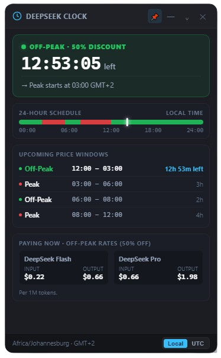
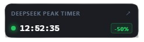

# 🕒 DeepSeek Peak / Off-Peak Price Timer

> A sleek, always-on-top floating desktop widget and status bar for Windows and KDE/Linux that tracks **DeepSeek API 50% off-peak discount hours** in real time.

[](https://www.electronjs.org/)
[](https://electronjs.org)
[](https://github.com/Kilowatch/deepseek-peak-timer?tab=readme-ov-file#GPL-3.0-1-ov-file)
[](https://github.com/Kilowatch/deepseek-peak-timer/releases)

---

## ⚡ Direct Download (Standalone .exe)

No installation or Node.js runtime required! Download and run directly:

👉 **[⬇️ Download `DeepSeekPriceClock.exe` (v1.0.0)](https://github.com/Kilowatch/deepseek-peak-timer/releases/download/v1.0.0/DeepSeekPriceClock.exe)**

---

## 📸 Screenshots

| Full Expanded Dashboard | Floating Mini Bar (with Header & Countdown) |
| :---: | :---: |
|  |  |

---

## ✨ Features

- 🟢 **Live Status Indicators**:
  - **Green Glowing Dot**: Off-Peak is active (**50% Discount** applies to all API calls).
  - **Red Glowing Dot**: Peak rates active (standard pricing).
- ⏱️ **Real-Time Monospace Countdown**: Live ticking `HH:MM:SS` showing exact time remaining in the current pricing window.
- 🌍 **Automatic Local Timezone Detection**: Automatically detects your system timezone (e.g. `Africa/Johannesburg · GMT+2`) and maps the fixed UTC pricing schedule to your local clock, with a 1-click toggle to UTC.
- 📊 **24-Hour Timeline Visualizer**: Color-coded 24-hour track (Green = Off-Peak, Red = Peak) with a real-time glowing needle marker.
- 📅 **Upcoming Pricing Schedule Table**: Lists upcoming transitions with local time ranges, active duration, and time remaining.
- 💰 **DeepSeek Model Pricing Cards**:
  - **DeepSeek Flash**: `$0.22` input / `$0.66` output (Off-Peak) vs `$0.44` / `$1.32` (Peak).
  - **DeepSeek Pro**: `$0.66` input / `$1.98` output (Off-Peak) vs `$1.32` / `$3.96` (Peak).
  - Rate labels dynamically adjust based on active window.
- 📌 **Always-On-Top & Freely Draggable**: Pin it anywhere on screen so it floats above your IDE, browser, or terminal.
- 🗖 **Multi-Mode Windows**:
  1. **Floating Mini Bar**: Ultra-compact bar with `DEEPSEEK PEAK TIMER` header, status dot, live countdown timer, and `-50%` badge.
  2. **Full Expanded Dashboard**: Detailed schedule, rates, 24h timeline, and timezone controls.
  3. **System Tray Mode**: Hides into the Windows Taskbar Notification Area with a native Green/Red dot icon and live tooltip.
- 🔔 **Desktop Notifications**: Optional toast alert when price windows switch (e.g. *"50% discount is now active!"*).

---

## ⏰ DeepSeek Pricing Schedule (UTC)

DeepSeek API discounts apply during fixed UTC hours:

| Window | UTC Time Range | Status | Rate Discount |
| :--- | :--- | :---: | :---: |
| **Night Window** | `00:00 – 01:00 UTC` | 🟢 **Off-Peak** | **50% OFF** |
| **Morning Peak** | `01:00 – 04:00 UTC` | 🔴 **Peak** | Standard Price |
| **Mid-Day Window** | `04:00 – 06:00 UTC` | 🟢 **Off-Peak** | **50% OFF** |
| **Afternoon Peak** | `06:00 – 10:00 UTC` | 🔴 **Peak** | Standard Price |
| **Evening Window** | `10:00 – 24:00 UTC` | 🟢 **Off-Peak** | **50% OFF** |

---

## 🚀 Getting Started

### Method 1: Standalone Single-File Executable (Recommended)
1. Download **[`DeepSeekPriceClock.exe`](https://github.com/Kilowatch/deepseek-peak-timer/releases/download/v1.0.0/DeepSeekPriceClock.exe)**.
2. Double-click **`DeepSeekPriceClock.exe`** to run.
3. *(Optional)* Move it to your Desktop, startup folder, or USB drive.

---

### Method 2: Run from Source
1. **Clone the repository**:
   ```bash
   git clone https://github.com/Kilowatch/deepseek-peak-timer.git
   cd deepseek-peak-timer
   ```

2. **Install dependencies**:
   ```bash
   npm install
   ```

3. **Start the application**:
   ```bash
   npm start
   ```
   *(Or double-click `start.bat` on Windows)*

---

### Method 3: Build Your Own Standalone Executable
To package your own portable `.exe` into the `Standalone/` directory:
```bash
npm run build:standalone
```

### KDE/Linux (AppImage)

Run from source on KDE Plasma or another Linux desktop:

```bash
npm install
npm start
```

Build a portable AppImage:

```bash
npm run build:linux
chmod +x Standalone/DeepSeekPriceClock-*.AppImage
./Standalone/DeepSeekPriceClock-*.AppImage
```

`npm run build:linux:deb` and `npm run build:linux:rpm` produce optional native packages. Linux packages include a freedesktop `.desktop` launcher for KDE application-menu integration. On Wayland, KDE controls window placement because Wayland does not permit applications to set global screen coordinates. Enable **Start Automatically on Login** from the tray or window context menu to create a user-level XDG/KDE autostart entry.

---

## 🎮 Window Controls & Shortcuts

| Button / Action | Description |
| :--- | :--- |
| **`[📌]` Pin** | Toggle Always-On-Top mode |
| **`[—]` Minimize Bar** | Minimize to compact Floating Mini Bar with live countdown |
| **`[⌄]` Minimize Tray** | Minimize / Hide directly into the Windows Taskbar Notification Area |
| **`[↗]` Expand** | Expand from Mini Bar to Full Dashboard |
| **`[✕]` Exit** | Completely exit and close the application |
| **Right-Click Anywhere** | Opens the context menu (switch modes, toggle pin, or exit) |
| **Double-Click Mini Bar** | Instantly expands to Full Dashboard |

---

## 📁 Repository Structure

```
deepseek-peak-timer/
├── Standalone/
│   └── DeepSeekPriceClock.exe    # Standalone single-file portable executable
├── docs/
│   └── screenshots/              # GitHub README preview images
│       ├── full-dashboard.png
│       └── mini-bar.png
├── src/
│   ├── index.html                # App layout & views (Mini Bar + Dashboard)
│   ├── js/
│   │   ├── app.js                # UI controller, countdown ticker, mode switcher
│   │   └── calculator.js         # UTC schedule math & auto timezone engine
│   ├── styles/
│   │   └── main.css              # Modern acrylic glassmorphism & dark theme styles
│   └── assets/
│       └── icons/                # Multi-resolution ICO & PNG tray and app icons
├── main.js                       # Electron main process (tray, window management, IPC)
├── preload.js                    # Secure context bridge IPC
├── package.json                  # Project manifest & build scripts
├── start.bat                     # Quick launcher batch file
├── LICENSE                       # GNU General Public License v3.0
└── README.md                     # Documentation
```

---

## 📄 License

This project is licensed under the **[GPL-3.0 License](https://github.com/Kilowatch/deepseek-peak-timer?tab=readme-ov-file#GPL-3.0-1-ov-file)** - see the [LICENSE](LICENSE) file for details.
